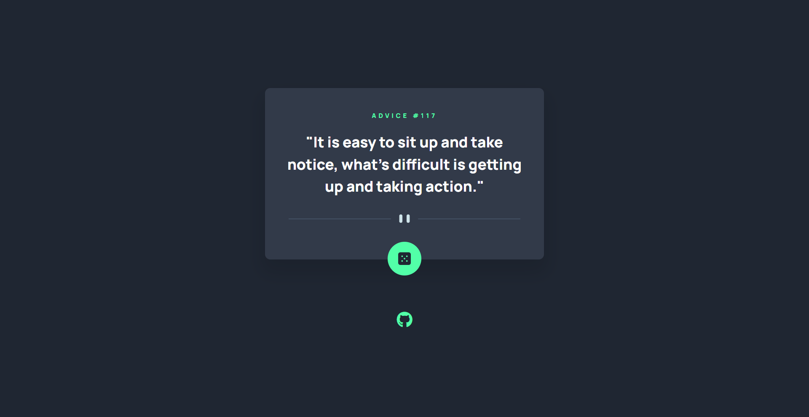

# Advice Generator App

## Links:
- [Challenge Link](https://www.frontendmentor.io/challenges/advice-generator-app-QdUG-13db)
- [Site Preview](https://robinjmm-advice-gen.vercel.app/)

## About
This is my solution for the Advice Generator App challenge from [Frontendmentor.io](https://frontendmentor.io)

## User Stories
The user should be able to:
- View the optimal layout for the app depending on their device's screen size
- See hover states for all interactive elements on the page
- Generate a new piece of advice by clicking the dice icon

## Built with
- HTML5
- CSS3
- SASS
- PostCSS
- JavaScript
- Vite

## Acknowledgement
I'm very grateful to the people at [Frontendmentor.io](https://frontendmentor.io) for providing designs and challenges that help me improve my skills as a web developer.